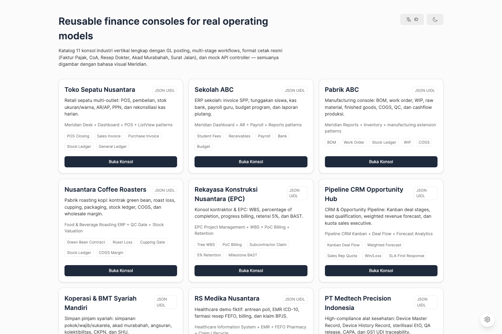
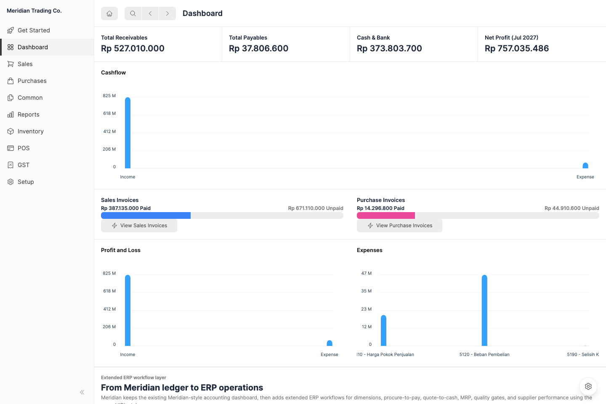
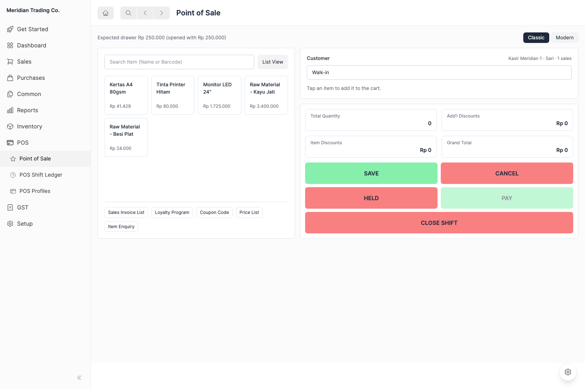
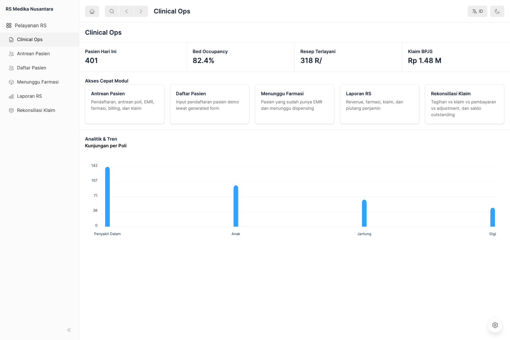

# uidl-runtime

[](https://www.npmjs.com/package/uidl-runtime)
[](https://github.com/hi-donwi/UIDL-Runtime/actions/workflows/ci.yml)
[](LICENSE)

A schema-driven React runtime that renders validated JSON documents into real application
surfaces — lists, forms, reports, dashboards and settings — without putting business
workflows inside page components.

A **UIDL document** is JSON describing layout, state, queries, bindings, events and actions.
`uidl-runtime` validates it against a Zod schema and renders it through a component registry.
Nothing in a document names a data source, an HTTP client or a database: reads go through a
single `DataAdapter` seam and writes go through a host-supplied mutation handler, so the same
document runs in memory, against a mock API, or against a real backend.

It was built for three callers: AI agents that generate interfaces from structured
instructions, ERP-style products whose screens are defined by metadata rather than code, and
low-code systems that need a validated document model instead of generated page files.

## Screenshots

Every screen below is generated UIDL, rendered by the same `UIDocumentRenderer` — none of it
is hand-built page markup.

| | |
|---|---|
|  <br> Reference gallery — 11 industry consoles plus Meridian |  <br> Meridian — cashflow, P&L and expenses derived from postings |
|  <br> Point of sale, generated from the same document model |  <br> Hospital reference console — one of eleven industry verticals |

## Install

```bash
npm install uidl-runtime
```

```tsx
import { DocumentSchema, UIDocumentRenderer, meridianLightTheme } from "uidl-runtime";
import "uidl-runtime/style.css";

const document = DocumentSchema.parse(rawDocument);

export function App() {
  return (
    <UIDocumentRenderer
      document={document}
      theme={meridianLightTheme}
      onRouteChange={(path) => navigate(path)}
    />
  );
}
```

## Status

The runtime and its reference suite are functional and covered by tests. **This is not a
production-ready product.** The reference applications are executable blueprints, not
certified systems — read the maturity table below before treating any of them as finished.

- 131 test files, 1176 tests, one typecheck, one lint pass
- 11 industry reference consoles plus a full double-entry accounting reference
- Every financial posting satisfies `sum(debit) === sum(credit)`, checked by an audit gate

## Contributing to this repository

The rest of this document is for working on `uidl-runtime` itself — the runtime, the
reference suite, and the build. If you only want to consume the library, `npm install
uidl-runtime` above is all you need.

Node.js LTS and npm.

```bash
git clone https://github.com/hi-donwi/UIDL-Runtime.git
cd UIDL-Runtime
npm install
npm run dev
```

To exercise the HTTP adapter instead of the in-memory one, run two terminals:

```bash
npm run mock:api            # mock API on port 8787
npm run dev:reference:http
```

## Commands

| Command | Purpose |
|---|---|
| `npm run dev` | Start the reference application suite in memory |
| `npm run dev:reference:http` | Start the suite with `VITE_DATA_MODE=http` |
| `npm run mock:api` | Start the local mock API on port 8787 |
| `npm run typecheck` | Type-check all workspaces |
| `npm run lint` | Run ESLint |
| `npm test` | Run Vitest unit and integration tests |
| `npm run build` | Build the public library and JSON schemas |
| `npm run build:reference` | Build the reference application suite |
| `npm run audit:reference` | Architecture, maturity and balanced-GL gates |
| `npm run test:reference` | Playwright acceptance tests, in memory |
| `npm run test:reference:visual` | Playwright visual baseline tests |
| `npm run test:reference:update` | Regenerate reviewed visual baselines |
| `npm run test:reference:http` | Playwright acceptance tests over HTTP |
| `npm run smoke:package` | Pack and consume the public npm artifact |
| `npm run validate:examples` | Validate the example UIDL documents |

## How it works

Reads flow one way, from metadata to rendered surface:

```text
DoctypeMeta / ModuleSpec
        -> page generator
        -> UIDLDocument            (validated by DocumentSchema)
        -> UIDocumentRenderer
        -> DataAdapter
```

Writes never take that path. They cross an explicit boundary instead:

```text
UIDL mutate action
        -> host mutationHandler
        -> document or domain service
        -> DataAdapter
```

The data mode is chosen in exactly one file, `packages/templates/src/config/data.config.ts`.
Documents and generators must not import a concrete adapter.

### Core concepts

- `$bind` reads reactive state or query results.
- `$query` delegates a read to the `DataAdapter`.
- `$expr` evaluates the supported declarative expressions, including aggregates.
- `mutate` delegates a write to the host and **fails closed** when no permitted handler exists.
- Generic list, form, workspace, settings, dashboard and report surfaces are generated UIDL.
- A composite transaction may use a thin React component when UIDL cannot express the
  interaction — but the business rules stay in services.

## Repository structure

```text
uidl-runtime/
├── packages/
│   ├── core/          # Schemas, renderer, state, actions, themes, registry, adapters
│   └── templates/     # Page generators, verticals, domain services, mock data
├── apps/reference/    # Executable references, playground, gallery, POS, regression harness
├── e2e/               # Browser acceptance and visual-regression tests
├── scripts/           # Audit, mock API, packaging and validation tools
└── docs/product/      # Background product notes, not a status authority
```

`packages/core`, `packages/templates` and `apps/reference` are private workspaces. The
published artifact is `uidl-runtime`, including its required `style.css`.

Visual regression tests are intentionally separate from the default reference command.
Run `npm run test:reference:visual` only on an environment with committed platform
baselines, and use `npm run test:reference:update` only for a reviewed visual change.

## Reference suite

**Meridian** is the core reference: a complete double-entry accounting desk — chart of
accounts, sales and purchase cycles, journal entries, payments, stock ledger, POS shifts,
General Ledger, Trial Balance, Profit and Loss and Balance Sheet. Every report is *derived*
from postings rather than hand-written, so the books balance by construction.

Eleven industry consoles sit beside it: shoe retail POS, school finance, manufacturing, food
roasting, EPC contracting, CRM, cooperative/BMT, hospital, medical device, omnichannel
distribution and helpdesk. Several model Indonesian business documents directly — Faktur
Pajak, e-Faktur DJP, Surat Jalan, Akad Murabahah — and the interface runs bilingually in
Indonesian and English.

Maturity is stated per reference rather than claimed for the suite:

| Level | Meaning |
|---|---|
| Concept Reference | Architecture or workflow direction, no complete user journey |
| UI Reference | Reusable interface pattern, no complete business execution |
| Functional Reference | Executable workflow with deterministic data and acceptance evidence |
| Domain-Verified Reference | Functional, plus proven domain invariants and reconciliation |
| Production-Ready | Operations, security, accessibility, performance and support proven |

Most verticals are Functional References. School dunning, koperasi murabahah collectibility,
hospital claim reconciliation and helpdesk SLA are Domain-Verified. **None is
Production-Ready.** A workflow counts as proven only when a browser test drives its UI;
calling a service directly counts as setup, not evidence.

## Implementation rules

- Presentation in components, reusable behaviour in hooks, pure functions in utilities,
  workflows and integrations in services.
- Validate every generated document with `DocumentSchema` before rendering.
- Keep one `DataAdapter` seam; never import a concrete adapter from a document, generator or
  UI component.
- Require `sum(debit) === sum(credit)` for every financial posting.
- Keep API-backed actions fail-closed and explicitly allowlisted.
- Use the shared design tokens and vector icons; respect `prefers-reduced-motion`.
- Do not introduce a second primary runtime model alongside `UIDLDocument`.

## Credits

Outline icons are from [Heroicons](https://heroicons.com) (MIT). The interface type is
[Inter](https://rsms.me/inter/) (SIL Open Font License).

## License

MIT — see [LICENSE](LICENSE).
